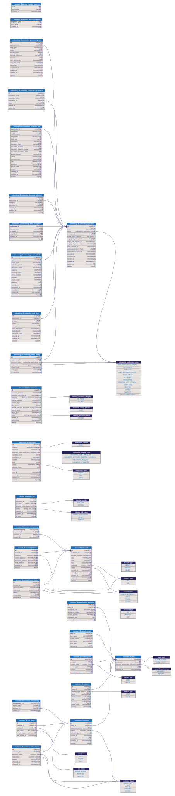

# Database model

The editable database model is maintained in `schema.dbml`.

The SVG file is a visual export used for quick reading.



`schema.dbml` represents the current database model from the service migrations. Runtime database changes are managed through each service's Flyway migrations.

Validate the DBML and regenerate the visual export from the repository root:

```powershell
npx.cmd --yes --package @dbml/cli@8.3.1-custom-metadata.2 dbml2sql docs/database/schema.dbml --mysql -o $env:TEMP/banking-schema.sql
npx.cmd --yes --package @softwaretechnik/dbml-renderer@1.0.31 dbml-renderer -i docs/database/schema.dbml -o docs/database/erd.svg
```
